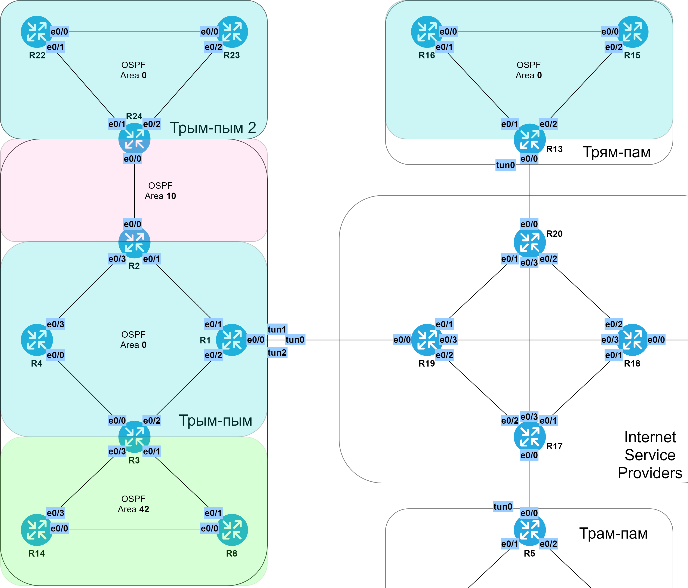
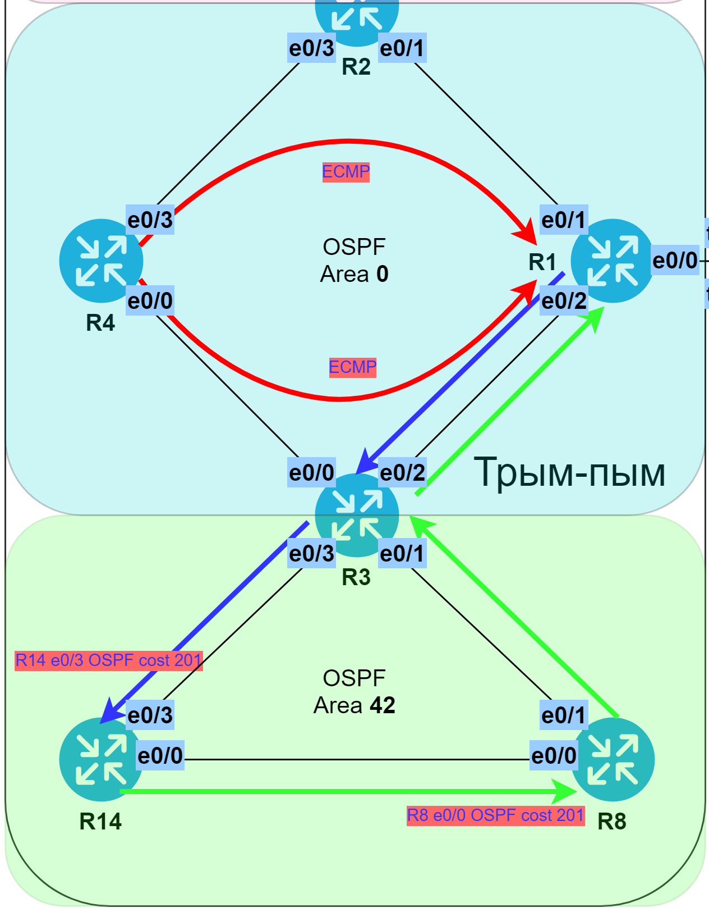

# Многозонный OSPF

###  Задание:

  1. Настроить OSPF в офисе "Трым-пым" с зонами 0, 10, 42;
  2. Изменить метрику маршрута в офисе "Трым-пым" так, чтобы трафик от R14 до R1 пошел через R8;
  3. Настроить метрику на R4 так, чтобы трафик до R1 один балансировался через R2 и R3;
  4. Задокументировать все изменения, произведенные в лабораторном стенде.

###  Решение:

  Router-ID присваивается исходя из логики: **0.0.0.{номер маршрутизатора}**.
  В зоне 0 для минимальной скорости обнаружения неполадок используется технология Fast Hello. В остальных зонах таймеры оптимизированы до значений 3/12.
  Включена парольная аутентификация в режиме MD5.
  Неиспользуемые сейчас интерфейсы переведены в режим Passive.
  Все файлы изменений приведены [здесь](configs/).

###  Схема зон OSPF

###  Комментарии:

  Для того, чтобы трафик от R14 гарантированно пошёл до R1 черех R8
  нужно сделать так, чтобы OSPF считал, что посылать его иным образом
  нецелесообразно (т.е. "дорого"). Для этого поднимем цену интерфейсов e0/3 на R14 и
  e0/0 на R8. Цену нужно установить такую, чтобы она минимум на 1 превышала
  суммарную стоимость интерфейсов по оптимальному пути - в данном случаем 201 > 200.
  Тогда трафик пойдет по цепочке R14 > R8 > R3 > R1, но нужно помнить,
  что обратно трафик пойдёт напрямую, т.е. R1 > R3 > R14.

  Для балансировки трафика от R4 до R1 через R2 и R3 ничего настраивать дополнительно
  не нужно, т.к. уже в случае настроек по-умолчанию трафик балансируется через ECMP.

###  Иллюстрации к комментариям

