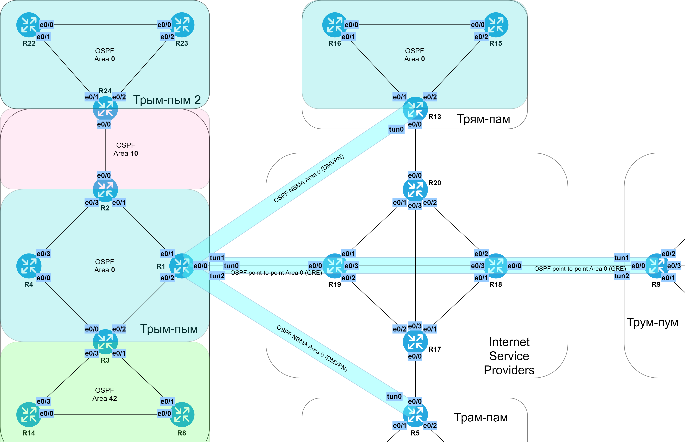

# OSPF и его работа в сетях NBMA

###  Задание:

  1. Настроить OSPF в DMVPN между офисами "Трым-пым" и "Трям-пам", "Трум-пум", "Трам-пам". В DMVPN необходимо использовать зону 0;
  2. Настроить OSPF в новом офисе "Трым-пым_2" с зоной 0;
  3. Настроить Virtual Link для работы зоны 0 OSPF;
  4. Задокументировать все изменения, произведенные в лабораторном стенде.

###  Решение:

  Router-ID присваивается исходя из логики: **0.0.0.{номер маршрутизатора}**.
  В зоне 0 broadcast для минимальной скорости обнаружения неполадок используется технология Fast Hello. В остальных зонах таймеры оптимизированы до значений 3/12.
  В зоне NBMA между R1, R5 и R13 таймеры 20/60, а на R1 ручное указание соседей
  и приоритет при выборах. В зоне point-to-point между R1 и R9 таймеры 20/60.
  Включена парольная аутентификация в режиме MD5.
  Неиспользуемые сейчас интерфейсы переведены в режим Passive.
  Все файлы изменений приведены [здесь](configs/).

###  Схема зон OSPF с учетом PtP и NBMA

